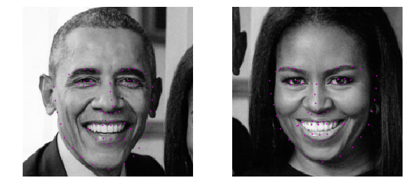
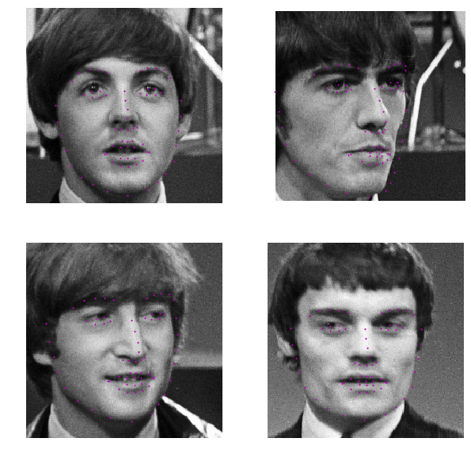
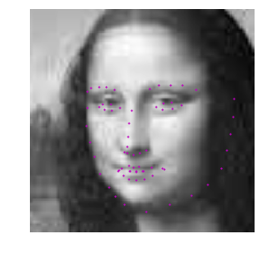

# Project 1: Facial Keypoint Detection

In this project, I build a facial keypoint detection system. The system consists of a face detector that uses Haar Cascades and a Convolutional Neural Network (CNN) that predict the facial keypoints in the detected faces. The facial keypoint detection system takes in any image with faces and predicts the location of 68 distinguishing keypoints on each face. The facial keypoints dataset used to train, validate and test the model consists of 5770 color images from the [ YouTube Faces Dataset](https://www.cs.tau.ac.il/~wolf/ytfaces/). 


## Results

I got the best results when doing transfer learning on a [pretrained resnet18 torchvision model](https://pytorch.org/docs/stable/torchvision/models.html).

### Test images
Here are the predicted keypoints using the resnet model on the provided test images.





### Webcam app

In addition to testing the model on the test images, I developed a small webcam application that runs in the notebook ```Keypoint Webcam.ipynb```. The application detects a face from your webcam feed and uses the model to predict the keypoints and draws a simple mask onto the face. The app has decent performance on my face, and runs with around 4-5 FPS on my computer.

<br>

I also tried this on Paddy the cat, but the face detector, which uses Haar Cascades, is designed for human faces, and only detects the cats face periodically. But when the cat gets recognized, the predictions aren't too bad.


---

The Udacity repository for this project: [P1_Facial_Keypoints](https://github.com/udacity/P1_Facial_Keypoints)
